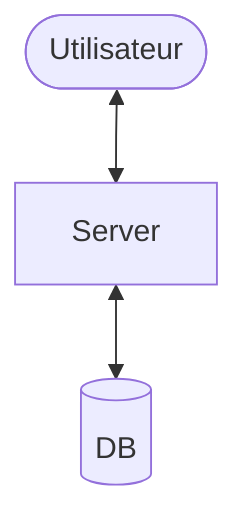
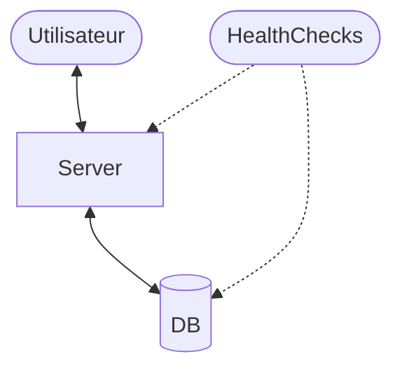
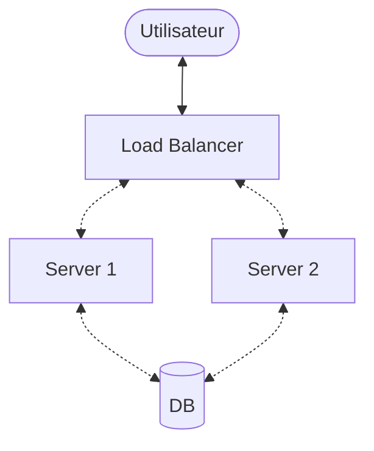
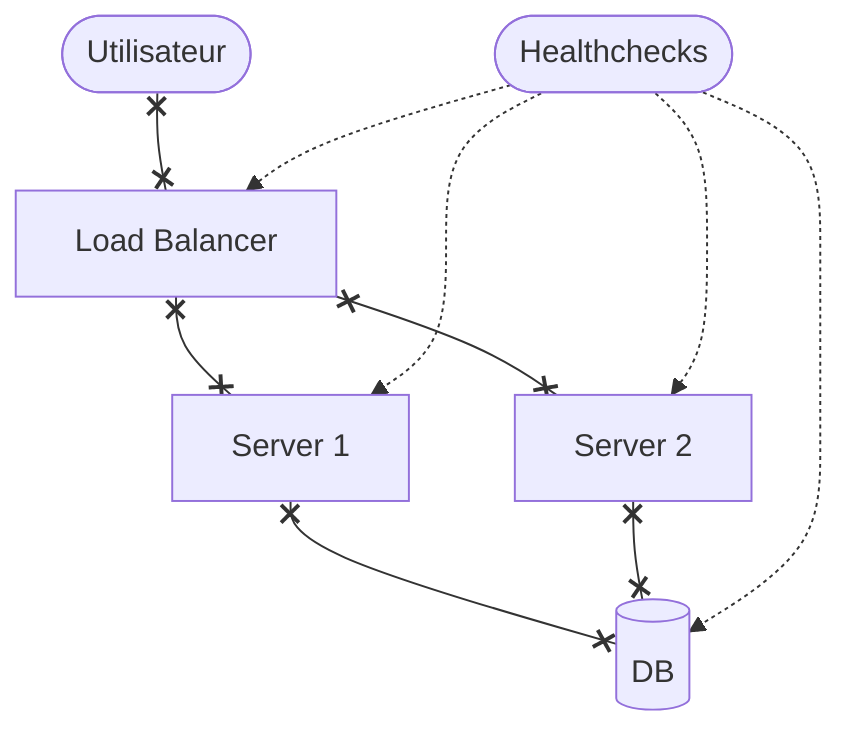

# Observability 101

## Avec OpenTelemetry!

---
hideInToc: true
---

<Toc />

---
layout: two-cols-header
---

# Draw64: Une belle démo
::left::
<Center>

</Center>
::right::
<ul>
    <v-click><li>High-Availability</li></v-click>
    <v-click><li>Auto-Scaling</li></v-click>
    <v-click><li>Rolling Releases</li></v-click>
    <v-click><li>Continuous Deployment</li></v-click>
</ul>

::bottom::

<v-click><center>Bref, c'est _lourd_ à gérer</center></v-click>

---
level: 3
---

# Monitoring: Healthchecks

<Center>

</Center>

---
level: 2
---

# High-Availability?

<Center>


(Le cluster de DB non-unique est laissé en exercice au lecteur)
</Center>

---
level: 3
---

# HA: Monitoring

<Center>

</Center>

---
layout: two-cols-header
level: 2
---

# Healthchecks

<Center>On a seulement des healthchecks</Center>

::left::

## Healthchecks

Est-ce que mon service est fonctionnel?

::right::

## Monitoring

**Comment** va mon service?

---
layout: two-cols-header
---

# Observabité

::left::
## Signaux communs

- Métriques
- Logs
- Traces

::right::
## Moins communs

- Erreurs
- Profiling
- Real User Monitoring (RUM)
- ...

---
layout: section
---

# OpenTelemetry

---

# OpenTelemetry: Un peu d'histoire

<center></center>

<center>Source: https://medium.com/opentracing/merging-opentracing-and-opencensus-f0fe9c7ca6f0</center>

---

# OpenTelemetry: Un Standard Unique?

<center></center>

<center>Source: XKCD, https://xkcd.com/927/</center>

---

# OpenTelemetry

<center></center>

<center>Source: OpenTelemetry, https://github.com/open-telemetry</center>

---

# OpenTelemetry
- ...
- IO/s

::right::

## Service

- Nombre de requêtes
- durée des requêtes
- Nombre d'erreurs
- ...

---
level: 2
---

# Centraliser les métriques

---

# Instrumentation Automatique: Trouver les packages existats

```sh
uv add --dev opentelemetry-bootstrap
```
```sh
opentelemetry-bootstrap
```

> opentelemetry-instrumentation-asyncio==0.49b2  
> opentelemetry-instrumentation-dbapi==0.49b2  
> opentelemetry-instrumentation-logging==0.49b2  
> opentelemetry-instrumentation-sqlite3==0.49b2  
> opentelemetry-instrumentation-threading==0.49b2  
> opentelemetry-instrumentation-urllib==0.49b2  
> opentelemetry-instrumentation-wsgi==0.49b2  
> opentelemetry-instrumentation-asgi==0.49b2  
> opentelemetry-instrumentation-fastapi==0.49b2  
> opentelemetry-instrumentation-httpx==0.49b2  
> opentelemetry-instrumentation-jinja2==0.49b2  
> opentelemetry-instrumentation-starlette==0.49b2  
> opentelemetry-instrumentation-system-metrics==0.49b2  
> opentelemetry-instrumentation-tortoiseorm==0.49b2

---

# Instrumentation Automatique: Installation

```sh
uv add opentelemetry-instrumentation-asyncio opentelemetry-instrumentation-dbapi \
opentelemetry-instrumentation-logging opentelemetry-instrumentation-sqlite3 \
opentelemetry-instrumentation-threading opentelemetry-instrumentation-urllib \
opentelemetry-instrumentation-wsgi opentelemetry-instrumentation-asgi \
opentelemetry-instrumentation-fastapi opentelemetry-instrumentation-httpx \
opentelemetry-instrumentation-jinja2 opentelemetry-instrumentation-starlette \
opentelemetry-instrumentation-system-metrics opentelemetry-instrumentation-tortoiseorm
```

---

# Instrumentation Automatique: Exécution

```sh
OTEL_SERVICE_NAME=draw64 \
OTEL_TRACES_EXPORTER=console \
OTEL_METRICS_EXPORTER=prometheus \
opentelemetry-instrument fastapi run draw64/app.py
```

---

# Instrumentation automatique: Système

```sh
uv add opentelemetry-instrumentation-system-metrics
```

```python {*|5|6}
from opentelemetry.metrics import set_meter_provider
from opentelemetry.sdk.metrics import MeterProvider
from opentelemetry.sdk.metrics.export import ConsoleMetricExporter, PeriodicExportingMetricReader

set_meter_provider(MeterProvider(PeriodicExportingMetricReader(ConsoleMetricExporter())))
SystemMetricsInstrumentor().instrument()
```


---
level: 2
---

# Instrumentation - Métriques - Exportation

```sh
uv add opentelemetry-exporter-prometheus
```

```diff
+from opentelemetry.exporter.prometheus import PrometheusMetricReader
from opentelemetry.metrics import set_meter_provider
from opentelemetry.sdk.metrics import MeterProvider
-from opentelemetry.sdk.metrics.export import ConsoleMetricExporter, PeriodicExportingMetricReader
+from opentelemetry.sdk.resources import SERVICE_NAME, Resource
+from prometheus_client import start_http_server

+set_meter_provider(
+    MeterProvider(
+        metric_readers=[PrometheusMetricReader()],
+        resource=Resource(
+            attributes={
+                SERVICE_NAME: "Draw64",
+            }
+        ),
+    )
+)
-set_meter_provider(MeterProvider(PeriodicExportingMetricReader(ConsoleMetricExporter())))
SystemMetricsInstrumentor().instrument()

# ...

+start_http_server(port=9464)
```

---

# Instrumentation automatique: FastAPI

```sh
uv add opentelemetry-instrumentation-fastapi
```

```python {*|2,8}
from fastapi import FastAPI
from opentelemetry.instrumentation.fastapi import FastAPIInstrumentor
# ...

app = FastAPI()
# ...

FastAPIInstrumentor.instrument_app(app)
```