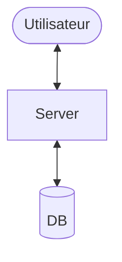
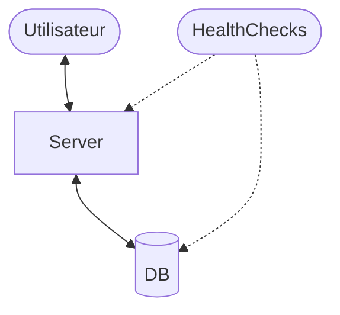
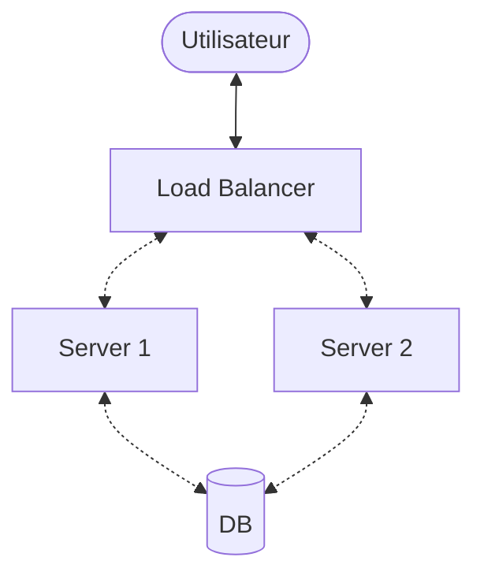
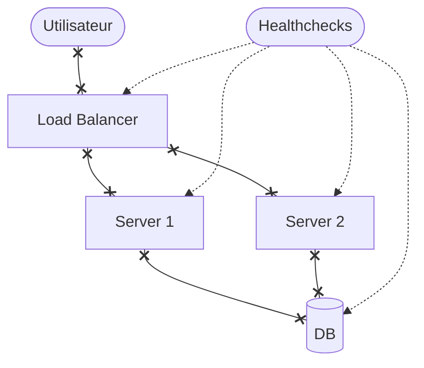

# Observability 101

## Avec OpenTelemetry!

---
hideInToc: true
---

<Toc />

--- 

# Observabité

- Métriques
- Logs
- Traces
- ...
- Erreurs

---

# Draw64: Une belle démo

---
level: 3
---

# Monitoring

---
level: 2
---

# High-Availability?

(Le cluster de DB non-unique est laissé en exercice au lecteur)

---
level: 3
---

# HA: Monitoring

---
layout: two-cols-header
level: 2
---

# Healthchecks

On a seulement des healthchecks

::left::

## Healthchecks

Est-ce que mon service est fonctionnel?

::right::

## Monitoring

**Comment** va mon service?

---

# OpenTelemetry

---
layout: two-cols-header
---

# Métriques

::left::

## Hôte

- CPU %
- Mémoire utilisée (%)
- Disque (Stockage) utilisé (%)
- IO/s

::right::

## Service

- Nombre de requêtes
- durée des requêtes
- Nombre d'erreurs
- ...

---
level: 2
---

# Centraliser les métriques

